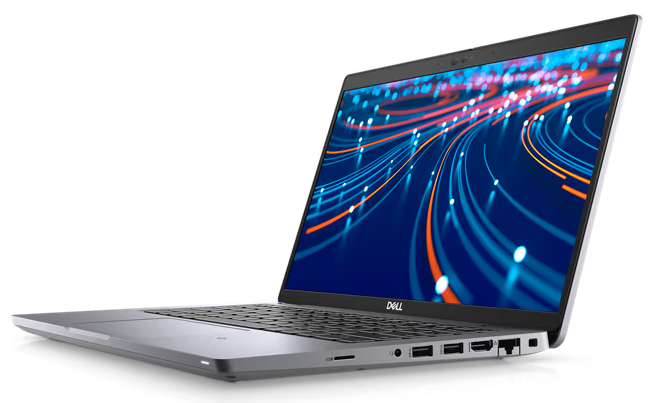
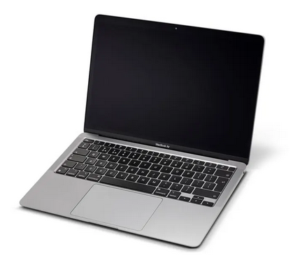
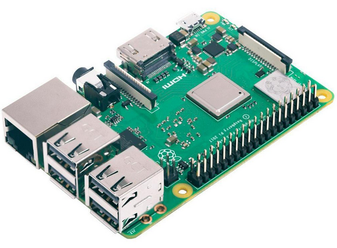

# TRABALHO BIG DATA
 
Trabalho desenvolvido para o módulo de Big Data do curso de especialização em Ciência de Dados do Centro Universitário Facens

## Hardwares
 
<pre>
<b>Notebook</b>
Modelo: Dell Latitude 5420
OS: Ubuntu 22.04.2 LTS
Arquitetura: x86_64
Processador: Intel(R) Core(TM) i5-1145G7 @ 2.60GHz
Armazenamento: 512 GB (NVMe ADATA)
RAM: 16 GB
</pre>
 
<pre>
<b>MacBook</b>
Modelo: MacBook Air M1
OS: macOS Ventura 13.4.1
Arquitetura: ARM64
Processador: Apple Silicon M1
Armazenamento: 512 GB (SSD)
RAM: 8 GB
</pre>
 
<pre>
<b>Raspberry Pi</b>
Modelo: Raspberry Pi 3 B+
OS: Raspbian GNU/Linux 11 (bullseye)
Arquitetura: ARM64
Processador: Cortex-A53 @ 1.4GHz
Armazenamento: 16 GB (Micro SD)
RAM: 1 GB
</pre>
