# TRABALHO BIG DATA
 
Trabalho desenvolvido para o módulo de Big Data do curso de especialização em Ciência de Dados do Centro Universitário Facens

## TÓPICOS
- INTRODUÇÃO
- FONTE DE DADOS
- ARQUITETURA
- IMPLEMENTAÇÃO
- DESAFIOS
- MELHORIAS
- CONCLUSÃO E OBSERVAÇÕES GERAIS

## INTRODUÇÃO
### Objetivo
- Projetar uma arquitetura Big Data para uma determinada fonte de dados
- Comparar outras tecnologias possíveis

## FONTE DE DADOS
Foi escolhido trabalhar com uma fonte de dados proveniente de algum e-commerce. 
Esses dados serão extraídos através de Web Scraping visando coletar informações dos produtos mais vendidos.

Para a extração dos dados vamos utilizar o site do Mercado Livre.
  
Utilizando Web Scraping conseguimos extrair os dados abaixo:
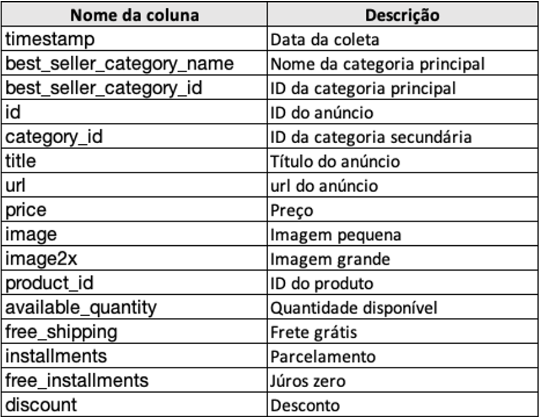

# ARQUITETURA
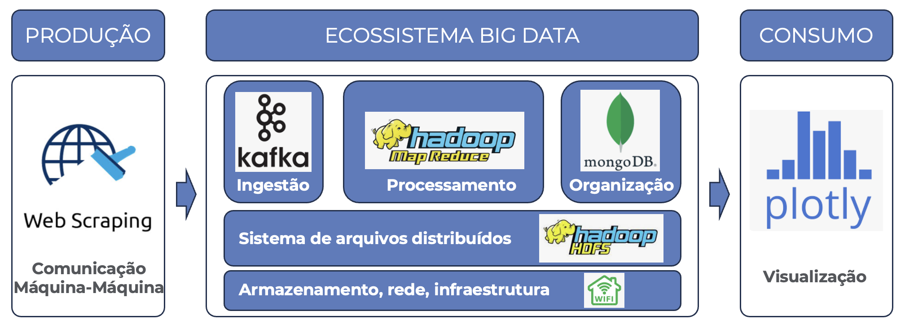
A arquitetura foi planejada da seguinte forma:  
<b>Web Scraping: </b> Para coleta dos dados, é aqui que o dataset será formado. 
<b>Apache Kafka: </b> Para ingestão dos dados, ele será responsável por transmitir os dados coletados para o fluxo. 
<b>Hadoop Map Reduce: </b>Será responsável por realizar as transformações necessárias dos dados e prepará-las para a inserção no banco de dados. 
<b>Mongo DB: </b>Organizará os dados em coleções para serem consultados posteriormente. 
<b>Hadoop HDFS: </b>Responsável pelo armazenamento de arquivos distribuídos. 
<b>Rede doméstica: </b>Como estrutura de rede e armazenamento serão utilizados uma rede Wifi doméstica e computadores pessoais.  

## ARQUITETURA [HDFS]
A arquitetura detalhada do HDFS é mostrada a seguir: 
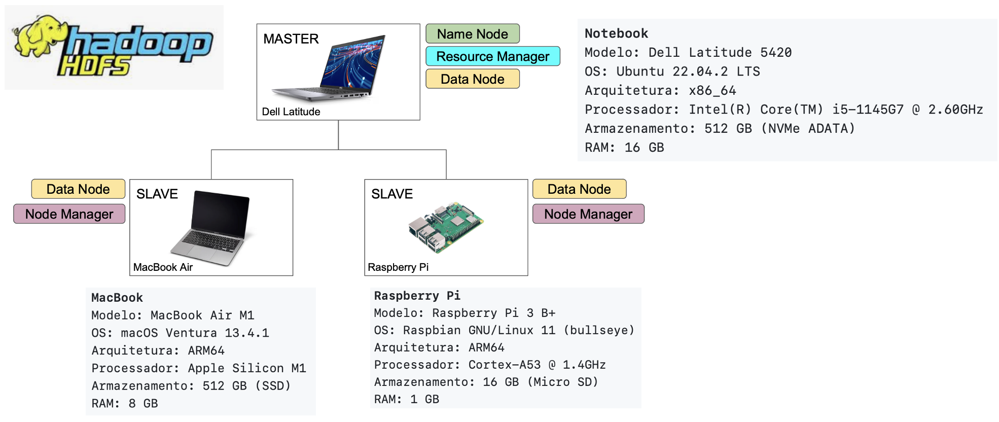
 
Como NameNode temos um notebok Dell que fará o controle de tudo no sistema distribuindo os arquivos e gerenciando os demais nós. Ele também funcionará como DataNode armazenando dados. 
Temos dois dispositivos configurados como escravos. Um MacBook Air e um Raspberry Pi que terão como funcionalidade o armazenamento de arquivos. 
Neste sistema o hdfs se encarrega da parte de armazenamento do NameNode e dos DataNodes enquanto o yarn se encarrega do gerenciamento de recursos ResourceManager e NodeManager. Cada um dos dispositivos é um nó do sistema e o conjunto dos três dispositivos é chamado de Cluster.

# IMPLEMENTAÇÃO
A implementação não foi uma tarefa fácil, principalmente pela diversidade de dispositivos com configurações distintas. 
Como primeiro passo eu optei por instalar e configurar cada coisa. 
Abaixo pode-se observar o que deu certo e o que deu errado:  
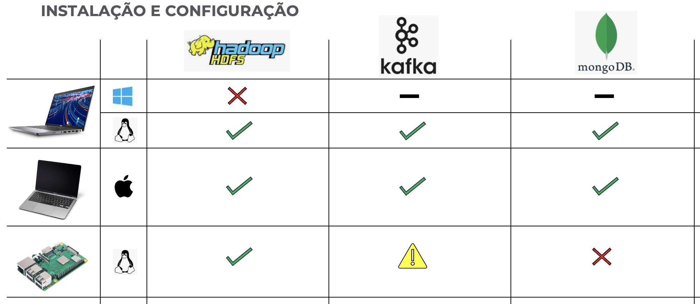
Inicialmente tentei instalar o Hadoop HDFS no Windows 11. A instalação não foi um problema, porém ao tentar comunicar com os demais nós não obtive sucesso. 
O hdfs utiliza o protocolo SSH para se comunicar com os nós, porém parece que o SSH não se dá bem com o sistema de autenticação do Windows (Windows Hello), pois a autenticação é feita através de biometria e não há um usuário e senha convencional necessários para a autenticação via SSH. A solução foi instalar uma distribuição do Ubuntu ao lado do Windows.
<small>[https://github.com/eduardoseity/facens-trabalho-bigdata/issues/1]</small>

Após a instalação do Ubuntu tudo correu bem assim como para a instalação no MacOS que também não apresentou dificuldades. 
Para o dispositivo Raspberry Pi, apesar de ter um sistem operacional Linux, houve dificuldade na instalação padrão do Kafka, pois o mesmo indicava falta de memória para iniciar o serviço. Apesar do problema a solução foi relativamente simples, sendo necessário alterar a configuração de quanta memória o Kafka utilizaria, para isso bastou configurar a variável de ambiente <i>KAFKA_HEAP_OPTS</i>.
<small>[https://github.com/eduardoseity/facens-trabalho-bigdata/issues/2]</small>

Um outro problema envolvendo o nó Raspberry Pi foi na instalação do mongo DB, pois não existe uma versão apropriada para o sistema operacional. Neste caso decidi seguir o projeto sem a instalação do mesmo.

Uma coisa que me ajudou muito na configuração dos programas foi ler os arquivos de log, pois por diversas vezes me vi tentando solucionar o erro através da mensagem que aparecia na tela do terminal, porém a mensagem muitas vezes não dá detalhes sobre o erro e pode também te induzir para um caminho errado. Já os logs são bem detalhados e apontam o real problema que está ocorrendo.
## IMPLEMENTAÇÃO [TESTE DOS RECURSOS]
Após ter instalado e configurado tudo, o próximo passo que segui foi testar tudo. Verificar o funcionamento individual de cada coisa me ajudou a ter certeza de que eu conseguiria seguir para as próximas etapas sem muito sofrimento.
### HDFS
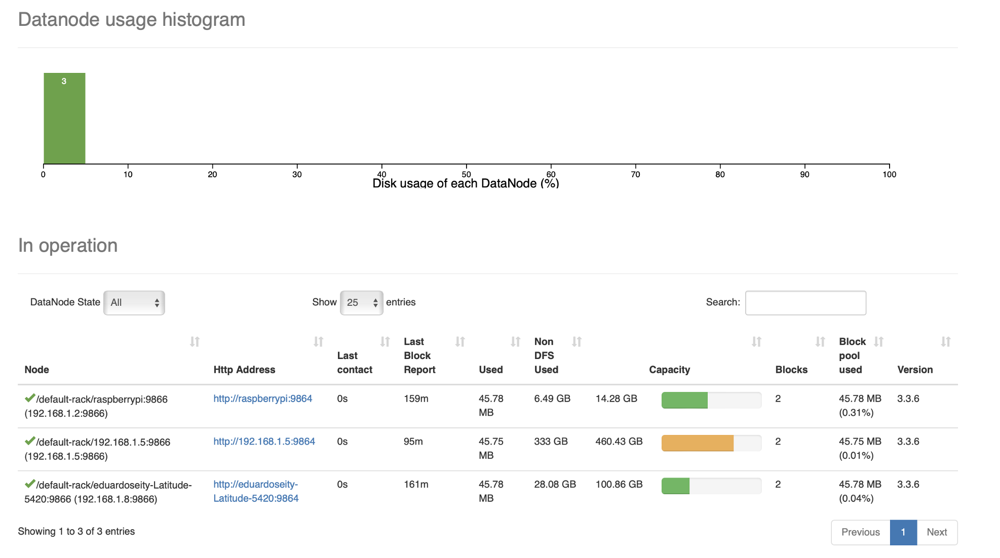
O hdfs possui uma interface web para gerenciar os recursos de forma fácil. Acima é possível verificar que os 3 nós estão ativos.
  
<b>Teste de disponibilidade</b>
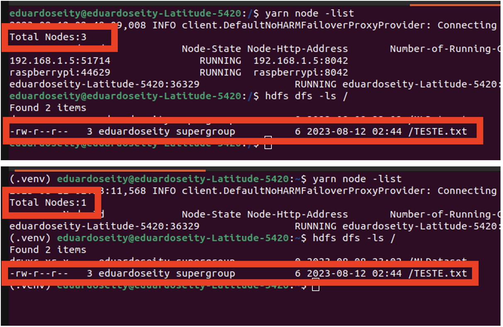
Realizei um teste para testar a disponibilidade de arquivos no sistema distribuído. O hdfs está configurado para trabalhar com 3 réplicas dos arquivos, isso siginifica que cada arquivo salvo no sistema terá 3 locais de armazenamento para o caso de falha em algum dos nós. 
A primeira tela mostra um total de 3 nós ativos e é possível observar o arquivo <i>TESTE.txt</i> salvo na raíz do hdfs. 
Na segunda tela foram desabilitados 2 nós e listados os arquivos da raíz. É possível verificar que mesmo com apenas 1 nó em funcionamento o arquivo <i>TESTE.txt</i> ainda pode ser acessado.
 
Com isso validamos a parte do hdfs.

### KAFKA
<b>Teste de envio de mensagens</b>
O Kafka funciona como um serviço de mensageria onde as mensagens são enviadas para um tópico previamente criado. Esses tópicos podem ser consumidos por qualquer nó que precise das informações.

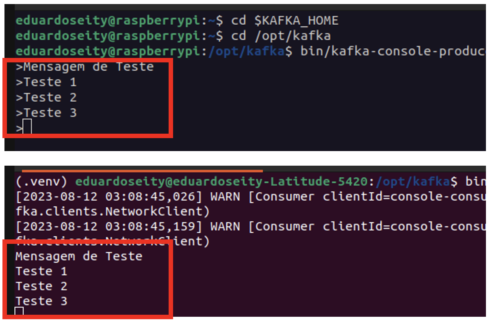
O teste realizado acima mostra o nó Raspberry Pi enviando as mensagens de teste para um tópico de teste e as mesmas mensagens sendo consumidas pelo nó Dell Latitude. Esta troca de mensagens acontece em tempo real que é uma das fortes características do Kafka.

### MAP REDUCE
<b>Teste utilizando a bilbioteca MRJob</b>
A biblioteca MRJob desenvolvida para Python facilita a criação de rotinas Map Reduce em ambientes hdfs. A documentação pode ser lida no link <small>[https://mrjob.readthedocs.io/en/latest/]</small>.

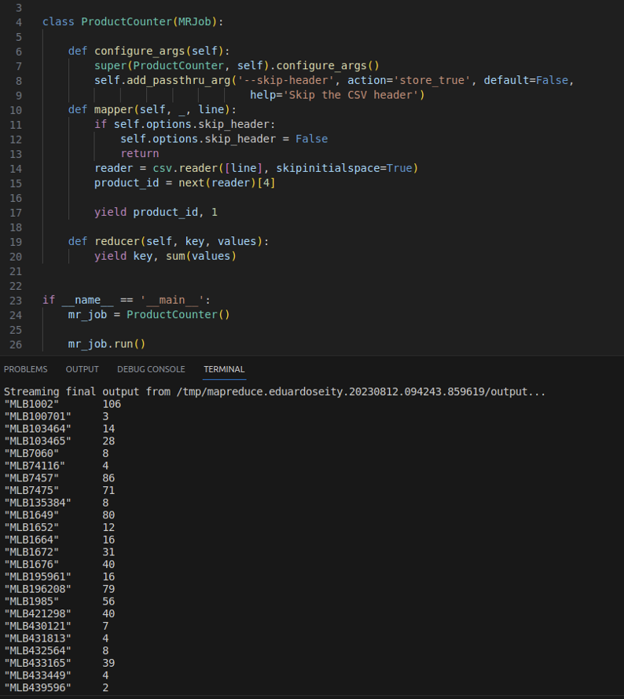

O algoritmo criado faz a separação das categorias em chave-valor, onde a chave representa a categoria e o valor inicialmente é 1. O próximo passo é realizar a somatória dos valores para cada categoria, obtendo a quantidade de vezes que cada categoria aparece no dataset.

### MONGO DB
O mongo DB foi testado utilizando o mongosh que é um shell para poder interagir com os bancos de dados e coleções de forma prática.
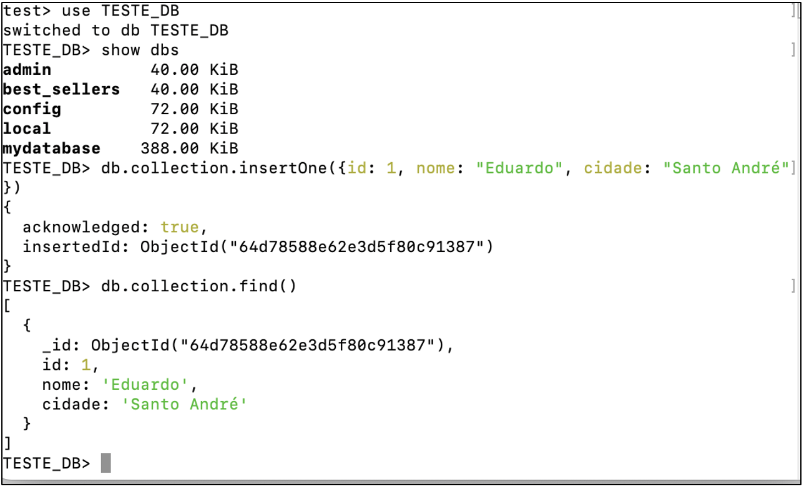
Acima um exemplo de criação de uma coleção dentro do banco de dados TESTE_DB.
## IMPLEMENTAÇÃO [FLUXO]
Abaixo podemos ver o fluxo da implementação e cada tecnologia utilizada. O fluxo começa com a coleta de dados, ingestão, transformação, carregamento e visualização.
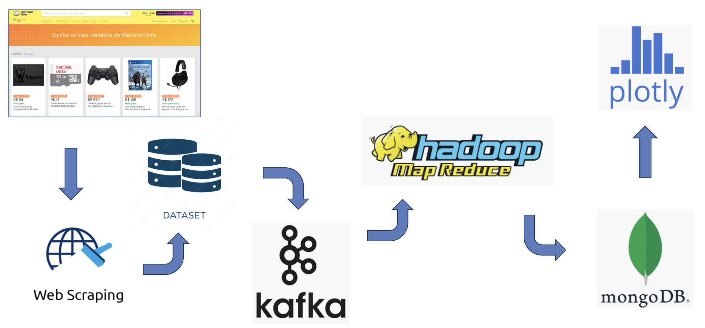
<b>Web Scraping</b> 
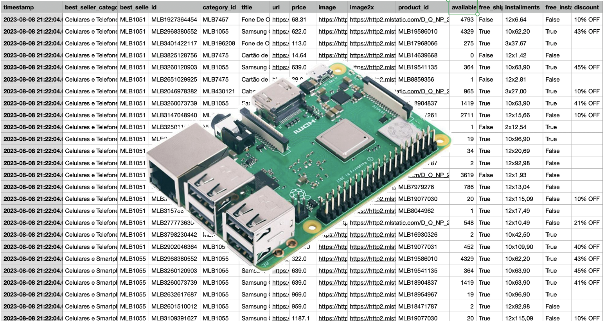
O script que realiza o scraping de dados foi salvo no Raspberry Pi que fica responsável pela execução todos os dias em um horário programado. 
Os dados são salvos localmente em um arquivo csv único.

<b>ETL</b> 
O ETL trata da extração, transformação e carregamento dos dados. 
Abaixo está um esquema de como isso funciona na nossa arquitetura.
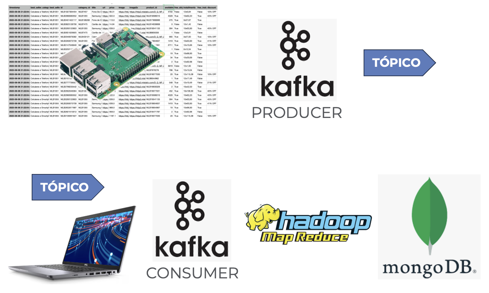
Resumidamente o Kafka se encarrega de fazer a extração do dataset e envia os dados através de um tópico. 
Ao receber uma mensagem no tópico o nó responsável envia os dados para o Map Reduce e os dados transformados são inseridos no banco de dados.
Ao final do processo teremos um banco de dados atualizado com os dados transformados pelo Map Reduce, neste exemplo teremos a contagem de quantas vezes cada categoria aparece no ranking de produtos mais vendidos.

<b>Plotly</b> 
A biblioteca Plotly foi utilizada para visualização dos dados, pois possui uma forma dinâmica de exibição dos gráficos e é fácil de implementar.
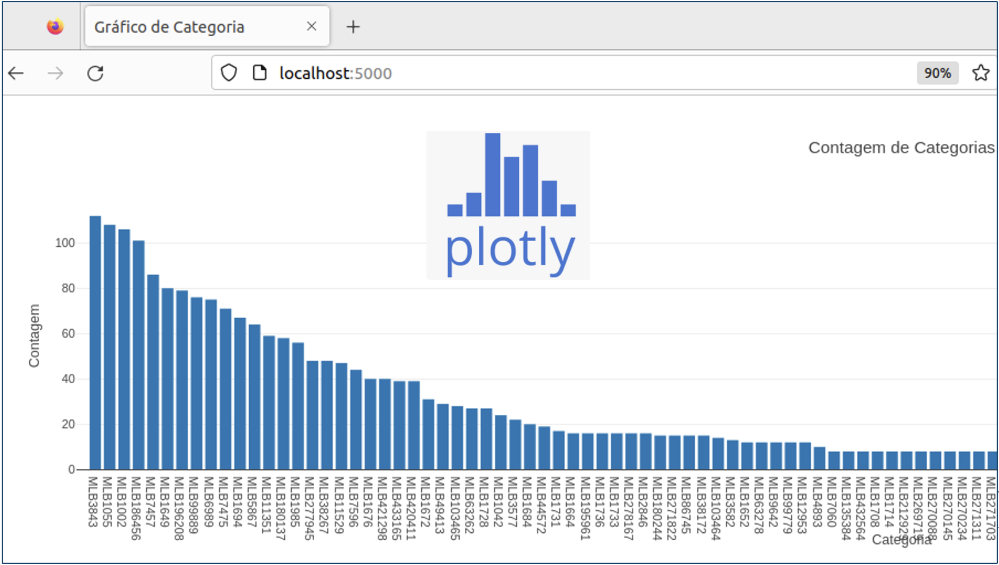
No exemplo acima foi criada uma visualização com os dados obtidos do banco de dados. A coleção apresenta quais são as categorias que mais aparecem no rank de produtos mais vendidos. 
Utilizando a mesma arquitetura é possível obter insights utilizando outras consultas, como por exemplo, qual é o preço médio dos produtos mais vendidos?, qual é a influência do frete grátis para que um produto esteja em um rank mais elevado?, até que valor de produto os juros começam a afetar a decisão de compra?, etc.

## DESAFIOS
Este projeto contou com muitos desafios, entre eles vale destacar:
- Baixo conhecimento contra diversidade de tecnologias

Eu não tinha intimidade com ferramentas de Big Data e a diversidade de ferramentas gerou um pouco de confusão na minha cabeça, pois parecia que muitas delas faziam a mesma coisa e muitas vezes foi difícil entender a diferença entre elas ou a necessidade real de utilizá-las.
- Instalação e configuração das ferrametas

Houve uma dificuldade devido a utlização de sistemas operacionais distintos o que agora eu enxergo como algo a se evitar em futuros projetos, mas claro que tudo isso foi positivo no sentido do aprendizado.
- Identificação das falhas durante o processo

Uma coisa que aprendi com esse projeto foi que utilizar os logs é essencial para resolver os problemas com eficiência. Os detalhes contidos neles são muito importantes para entender a causa do problema.
## MELHORIAS
Como melhorias posso apontar que a utilização de plataformas em nuvem em substituição de uma rede local ajudaria muito na configuração do sistema todo.
O uso de sistemas operacionais padronizados também ajudaria muito na configuração e compatibilidade.
Abaixo uma ilustração com tecnologias que poderiam substituir as que foram utilizadas neste projeto.

<b>Apache Pulsar: </b>Assim como o Kafka ele também funciona como um serviço de mensageria onde vários computadores podem se conectar a ele, porém diferentemente do kafka, é possível customizar as configurações para cada consumidor de acordo com a necessidade, sendo assim ele se torna mais flexível e customizado com relação ao recurso de troca de dados em tempo real. 
<b>Amazon Web Services: </b>É um serviço de computação em nuvem que possibilita escolher e configurar recursos de computação, armazenamento e rede conforme a necessidade e pagando apenas pelo que for usado. 
<b>Amazon DynamoDB: </b>Serviço de banco de dados totalmente gerenciado e escalável. É um serviço da AWS e possui integração com diversos outros serviços oferecidos pela Amazon.
## CONCLUSÕES E OBSERVAÇÕES GERAIS
O planejamento da arquitetura é um passo fundamental para obtenção de sucesso em um projeto de Big Data, pois existem diversos fatores que devem ser levados em consideração como o ambiente de trabalho, a compatibilidade dos recursos, a real necessidade de cada recurso, entre outros. 
Embora o processo de instalação e configuração utilizadas neste projeto não representem fielmente um projeto utilizado em produção (pois em um ambiente de produção precisamos nos preocupar com outros fatores como escalabilidade, segurança, disponibilidade, etc) este projeto se mostrou um bom caminho para se alcançar o objetivo de aprendizado acadêmico. 
Como próximo passo vou me aprofundar mais no recurso de ingestão em tempo real do Kafka que me chamou bastante atenção, mas por limitações de tempo não pude avançar muito neste trabalho. Pretendo fazer algum projeto voltado para IoT, pois pelo que pesquisei o Kafka é recomendado para este fim.
